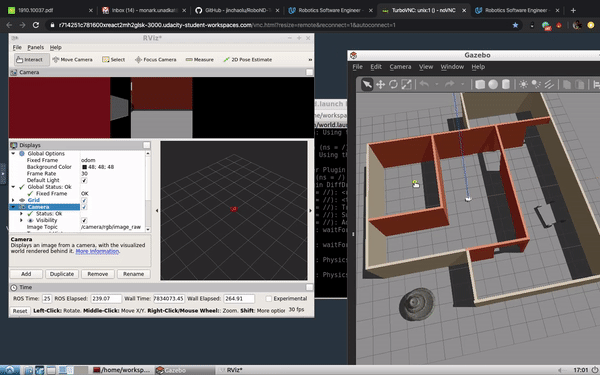

<h2>Project 2 --> Go Chase It</h2>



<h3>Project Overview and Requiments</h3>

In this project, you should create two ROS packages inside your src: the drive_bot and the ball_chaser. Here are the steps to design the robot, house it inside your world, and program it to chase white-colored balls:

* `drive_bot`:
  * Create a my_robot ROS package to hold your robot, the white ball, and the world.
  * Design a differential drive robot with the Unified Robot Description Format. Add two sensors to your robot: a lidar and a camera. Add Gazebo plugins for your robot’s differential drive, lidar, and camera. The robot you design should be significantly different from the one presented in the project lesson. Implement significant changes such as adjusting the color, wheel radius, and chassis dimensions. Or completely redesign the robot model! After all you want to impress your future employers :-D
  * House your robot inside the world you built in the Build My World project.
  * Add a white-colored ball to your Gazebo world and save a new copy of this world.
  * The world.launch file should launch your world with the white-colored ball and your robot.

* `ball_chaser`:
  * Create a ball_chaser ROS package to hold your C++ nodes.
  * Write a drive_botC++ node that will provide a ball_chaser/command_robot service to drive the robot by controlling its linear x and angular z velocities. The service should publish to the wheel joints and return back the requested velocities.
  * Write a process_image C++ node that reads your robot’s camera image, analyzes it to determine the presence and position of a white ball. If a white ball exists in the image, your node should request a service via a client to drive the robot towards it.
  * The ball_chaser.launch should run both the drive_bot and the process_image nodes.
  * The robot you design in this project will be used as a base model for all your upcoming projects in this Robotics Software Engineer Nanodegree Program.

### Dependencies
* Gazebo >= 7.0  
* ROS Kinetic  
* make >= 4.1(mac, linux), 3.81(Windows)
  * Linux: make is installed by default on most Linux distros
  * Mac: [install Xcode command line tools to get make](https://developer.apple.com/xcode/features/)
  * Windows: [Click here for installation instructions](http://gnuwin32.sourceforge.net/packages/make.htm)
* gcc/g++ >= 5.4
  * Linux: gcc / g++ is installed by default on most Linux distros
  * Mac: same deal as make - [install Xcode command line tools]((https://developer.apple.com/xcode/features/)
  * Windows: recommend using [MinGW](http://www.mingw.org/)

### Project Description  
Directory Structure  
```
PROJECT2__Go-Chase-It
├── README.md
├── ball_chaser.gif
└── src
    ├── CMakeLists.txt -> /opt/ros/kinetic/share/catkin/cmake/toplevel.cmake
    ├── ball_chaser
    │   ├── CMakeLists.txt
    │   ├── launch
    │   │   └── ball_chaser.launch
    │   ├── package.xml
    │   ├── src
    │   │   ├── drive_bot.cpp
    │   │   └── process_image.cpp
    │   └── srv
    │       └── DriveToTarget.srv
    └── my_robot
        ├── CMakeLists.txt
        ├── launch
        │   ├── robot_description.launch
        │   └── world.launch
        ├── mesh
        │   └── hokuyo.dae
        ├── package.xml
        ├── urdf
        │   ├── my_robot.gazebo
        │   └── my_robot.xacro
        └── worlds
            ├── empty.world
            └── monark.world

```
- [ball_chaser.gif](ball_chaser.gif): A demo video for successful run.  
- [ball_chaser.launch](/src/ball_chaser/ball_chaser.launch): Launches drive_bot and process_image nodes.
- [DriveToTarget.srv](/src/ball_chaser/src/DriveToTarget.srv): Contains defination of request and response structure for `DriveToTarget` service.
- [drive_bot.cpp](/src/ball_chaser/src/drive_bot.cpp): ROS service C++ script, command the robot with specify speeds.  
- [process_images.cpp](/src/ball_chaser/src/process_images.cpp): ROS service C++ script, process the camera image and return requested speeds. 
- [robot_description.launch](/src/my_robot/launch/robot_description.launch): Create my_robot model in Gazebo world.  
- [world.launch](/src/my_robot/launch/world.launch): Launch my_robot model in Gazebo world with building and plugins.  
- [my_robot.gazebo](/src/my_robot/urdf/my_robot.gazebo): Define my_robot URDF model plugins.  
- [my_robot.xacro](/src/my_robot/urdf/my_robot.xacro): Define my_robot URDF model.  
- [monark.world](/src/my_robot/worlds/monark.world): Gazebo world file created in [Project 1](https://github.com/monark12/Udacity-Robotics-Software-Engineer-NanoDegree/tree/master/PROJECT1__Build-My-World) that includes the models.  
- [CMakeLists.txt](/src/my_robot/CMakeLists.txt): File to link the C++ code to libraries.  
- [hokuyo.dae](/src/my_robot/mesh/hokuyo.dae): Hokuyo LiDAR sensor mesh model.  
- [my_robot.gazebo](/src/my_robot/urdf/my_robot.gazebo): Define my_robot URDF model plugins.  
- [my_robot.xacro](/src/my_robot/urdf/my_robot.xacro): Define my_robot URDF model.    

### Run the project  
* Clone this repository  
```bash
cd PROJECT2__Go-Chase-It/src
catkin_init_workspace # To create a symlink from /opt/ros/kinetic/share/catkin/cmake/toplevel.cmake
cd ..
catkin_make
```
* If you get any error, update your system packages or add `add_compile_options(-std=c++11)` in PROJECT2__Go-Chase-It/src/CMakeLists.txt


* Launch the robot inside your world 
```bash
cd PROJECT2__Go-Chase-It/
source devel/setup.bash
roslaunch my_robot world.launch
```


* Run `drive_bot` and `process_image`. 
* Open a new terminal.
```bash
cd PROJECT2__Go-Chase-It/
source devel/setup.bash
roslaunch ball_chaser ball_chaser.launch
```

* To visualize robot's camera images
* Open a new Terminal.
```bash
cd PROJECT2__Go-Chase-It/
source devel/setup.bash
rosrun rqt_image_view rqt_image_view  
```