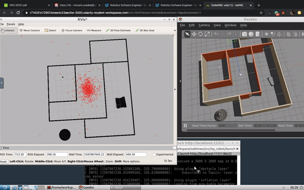

[](https://www.udacity.com/robotics)

<h2>Project 3 --> Where Am I</h2>



<h3>Project Overview and Requiments</h3>
In this project, you will learn to utilize ROS AMCL package to accurately localize a mobile robot inside a map in the Gazebo simulation environments.

Over the course of this lesson, you will learn several aspects of robotic software engineering with a focus on ROS:

 * Create a ROS package that launches a custom robot model in a custom Gazebo world
 * Utilize the ROS AMCL package and the Tele-Operation / Navigation Stack to localize the robot
 * Explore, add, and tune specific parameters corresponding to each package to achieve the best possible localization results

### Dependencies
* Gazebo >= 7.0  
* ROS Kinetic  
* make >= 4.1(mac, linux), 3.81(Windows)
  * Linux: make is installed by default on most Linux distros
  * Mac: [install Xcode command line tools to get make](https://developer.apple.com/xcode/features/)
  * Windows: [Click here for installation instructions](http://gnuwin32.sourceforge.net/packages/make.htm)
* gcc/g++ >= 5.4
  * Linux: gcc / g++ is installed by default on most Linux distros
  * Mac: same deal as make - [install Xcode command line tools]((https://developer.apple.com/xcode/features/)
  * Windows: recommend using [MinGW](http://www.mingw.org/)
* ROS navigation package
  `sudo apt-get install ros-kinetic-navigation`
* ROS map_server package
  `sudo apt-get install ros-kinetic-map-server`
* ROS move_base package
  `sudo apt-get install ros-kinetic-move-base`
* ROS amcl package
  `sudo apt-get install ros-kinetic-amcl` 
* `libignition-math2-dev` and `protobuf-compiler` to compile the map creator:
  `sudo apt-get install libignition-math2-dev protobuf-compiler`

### Project Description  
Directory Structure  
```
PROJECT3__Where-Am-I
├── README.md
├── localization.gif
└── src
    ├── CMakeLists.txt -> /opt/ros/kinetic/share/catkin/cmake/toplevel.cmake
    ├── amcl (...)
    ├── ball_chaser
    │   ├── CMakeLists.txt
    │   ├── launch
    │   │   └── ball_chaser.launch
    │   ├── package.xml
    │   ├── src
    │   │   ├── drive_bot.cpp
    │   │   └── process_image.cpp
    │   └── srv
    │       └── DriveToTarget.srv
    ├── my_robot
    │   ├── CMakeLists.txt
    │   ├── config
    │   │   ├── __MACOSX
    │   │   ├── base_local_planner_params.yaml
    │   │   ├── costmap_common_params.yaml
    │   │   ├── global_costmap_params.yaml
    │   │   └── local_costmap_params.yaml
    │   ├── launch
    │   │   ├── amcl.launch
    │   │   ├── robot_description.launch
    │   │   └── world.launch
    │   ├── maps
    │   │   ├── map.pgm
    │   │   └── map.yaml
    │   ├── mesh
    │   │   └── hokuyo.dae
    │   ├── package.xml
    │   ├── urdf
    │   │   ├── my_robot.gazebo
    │   │   └── my_robot.xacro
    │   └── worlds
    │       ├── empty.world
    │       └── monark.world
    ├── pgm_map_creator
    │   ├── CMakeLists.txt
    │   ├── LICENSE
    │   ├── README.md
    │   ├── launch
    │   │   └── request_publisher.launch
    │   ├── maps
    │   │   └── map.pgm
    │   ├── msgs
    │   │   ├── CMakeLists.txt
    │   │   └── collision_map_request.proto
    │   ├── package.xml
    │   ├── src
    │   │   ├── collision_map_creator.cc
    │   │   └── request_publisher.cc
    │   └── world
    │       ├── monark.world
    │       └── udacity_mtv
    └── teleop_twist_keyboard
        ├── CHANGELOG.rst
        ├── CMakeLists.txt
        ├── README.md
        ├── package.xml
        └── teleop_twist_keyboard.py

```
Most of the files are already explained in the previous projects. For this projects, the main changes are the 
 - [amcl](https://github.com/ros-planning/navigation/tree/melodic-devel/amcl): This package implements **Adaptive Monte Carlo Localization (AMCL)** technique which is used in the project to localize the robot inside the provided map
 - [pgm_map_creator](https://github.com/udacity/pgm_map_creator): Create **pgm map** from Gazebo world file for ROS localization
 - [teleop_twist_keyboard](https://github.com/ros-teleop/teleop_twist_keyboard): Using this package, we can send motion commands to the robot using keyboard or controller
 - [my_robot](/src/my_robot): This package contains our world and robot model.  THere are 2 new files added
   - [map.pgm](/src/my_robot/maps/map.pgm): Map file generated from pgm_map_creator.
   - [amcl.launch](/src/my_robot/launch/amcl.launch): Launches 2 nodes
     - amcl node which takes `odometry` and `laser scan data` to perform the AMCL localization.
     - move_base node from [move_base](http://wiki.ros.org/move_base) package. It provides implementation for navigation given a nav_goal path.

### Run the project  
* Clone this repository  
```bash
cd PROJECT3__Where-Am-I/src
catkin_init_workspace # To create a symlink from /opt/ros/kinetic/share/catkin/cmake/toplevel.cmake
```

* add `add_compile_options(-std=c++11)` in PROJECT3__Where-Am-I/src/CMakeLists.txt
```
cd PROJECT3__Where-Am-I/
catkin_make
```

* Launch the robot inside your world 
```bash
cd PROJECT2__Go-Chase-It/
source devel/setup.bash
roslaunch my_robot world.launch # this will also launch rviz visualizer
```

* Launch amcl and move_base using the amcl.launch file.
* Open a new terminal.
```bash
cd PROJECT2__Go-Chase-It/
source devel/setup.bash
roslaunch my_robot amcl.launch
```